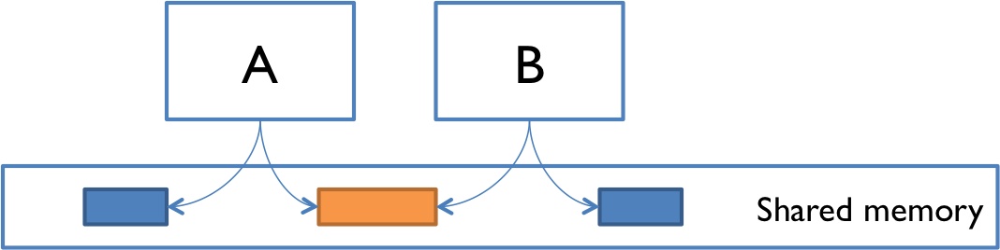

# 04 Concurrency vs Parallel
---
Concurrency dan Parallelism sering dianggap mirip, namun keduanya memiliki perbedaan penting. Mari kita bandingkan:

- ### Concurrency

Concurrency adalah kemampuan untuk menangani beberapa tugas sekaligus dalam periode waktu yang tumpang tindih. Ini tidak berarti tugas-tugas tersebut dijalankan pada saat yang persis sama.



<i>contoh code:</i>

```cpp
#include <iostream>
#include <omp.h>
void spam_msg(int thread_id){
    std::cout << "Hello dari thread " << thread_id << std::endl;
}
int main() {
    // cara mengetahui core yang dipakai
    int num_cores = omp_get_num_procs();
    std::cout << "Jumlah core yang terdeteksi: " << num_cores << std::endl;
    omp_set_num_threads(num_cores/2);
    #pragma omp parallel
    {
        int thread_id = omp_get_thread_num();
        spam_msg(thread_id);
    }
    return 0;
}
```

- ### Parallelism
Parallelism adalah kemampuan untuk menjalankan beberapa tugas atau bagian dari tugas secara benar-benar bersamaan.

```cpp
#include <iostream>
#include <omp.h>

void spam_msg(int threadID){
    std::cout<<"Hallo dari thread"<<threadID<<std::endl;
}
void spam_msgConcurrency(int num_cores){
    omp_set_num_threads(num_cores/2);
    #pragma omp parallel
    {
        int threadID = omp_get_thread_num();
        spam_msg(threadID);
    }
}
void spam_msgParallel(int num_cores){
    // share parallel with private methods
    int th_id;
    omp_set_num_threads(num_cores/2);
    #pragma omp parallel private(th_id)
    {
        th_id = omp_get_thread_num();
        spam_msg(th_id);
    }
}

int main() {
    int num_cores = omp_get_num_procs();
    std::cout << "Jumlah core yang terdeteksi: " << num_cores << std::endl;
    
    std::cout << "Concurrency" << std::endl;
    spam_msgConcurrency(num_cores);
    
    std::cout << "Parallel private" << std::endl;
    spam_msgParallel(num_cores);

    return 0;
}
```

