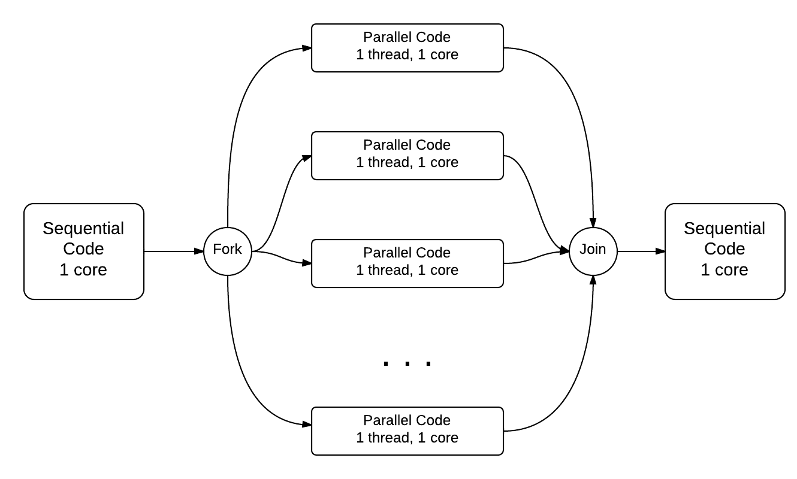

# Fork Join Pattern

### 1.1.1 The Fork-Join Pattern

didalam OpenMP,kita memulai Fork-Join pattern parallel sebagai berikut



Dalam diagram di atas, kita dapat melihat bagaimana thread utama memecah dirinya menjadi beberapa thread anak. Masing-masing thread anak akan mengerjakan sebagian dari beban kerja total, sehingga komputasi dapat diselesaikan dengan lebih cepat.
Setelah semua thread anak selesai menjalankan tugas masing-masing, mereka akan "bergabung" (join) kembali dengan thread utama. Pada tahap ini, thread utama akan menunggu hingga semua thread anak telah selesai sebelum melanjutkan eksekusi kode selanjutnya.

block `#pragma omp parallel`merupakan block untuk melakukan set terhadap thread untuk mengeksekusi pada program tersebut.
hasil block `#pragma omp parallel` mengakibatkan hasil outputnya secara random alias asyncronus.

- ## Sequential
---

```cpp
#include<iostream>
#include<omp.h>

int main(){
    printf("\n Sebelumnya \n");
    // #pragma omp parallel
    printf("\n During \n");
    printf("\n Sesudah \n");
    return 0;
}
```


- ## Concurency Example

```cpp
#include<iostream>
#include<omp.h>
int main(){
    #pragma omp parallel
    printf("\n During \n")
    return 0;
}
```

- ## for SPMD example

```cpp
#include<iostream>
#include<omp.h>
int main(){
    #pragma omp parallel
    {
        int id = omp_get_thread_num();
        int num = omp_get_num_thread();
        printf("Hello from thread %d of %d\n", id, numThreads);
    }
    return 0;
}
```

- ## Size Array with concurency
```cpp
#include <iostream>
#define N 100000
int main(){
    int* array = (int*)malloc(N*sizeof(int));
    int i;
    if (array == NULL) {  // check if malloc failed
        fprintf(stderr, "Memory allocation failed!\n");
        return 1;
    }
    for (int i=0;i<N;i++){
        array[i] = i++;

    }
}
```

-- Size Array with for parallel
```cpp
#include <stdio.h>
#include <stdlib.h>
#include <omp.h>  // Include the OpenMP header

#define N 20000000 // size of the array

int main(void) {
    int* array = malloc(N * sizeof(int)); // allocate memory

    if (array == NULL) {  // check if malloc failed
        fprintf(stderr, "Memory allocation failed!\n");
        return 1;
    }

    double start_time = omp_get_wtime();  // Start time measurement

    #pragma omp parallel
    {
        // Populate array
        #pragma omp for
        for (int i = 0; i < N; i++) {
            array[i] = i + 1;
        }
    }

    double end_time = omp_get_wtime();  // End time measurement
    double execution_time = end_time - start_time;

    printf("Done populating %d elements in %f seconds!\n", N, execution_time);
    free(array);  
    return 0;
}
```
